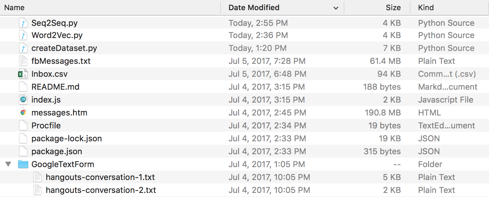
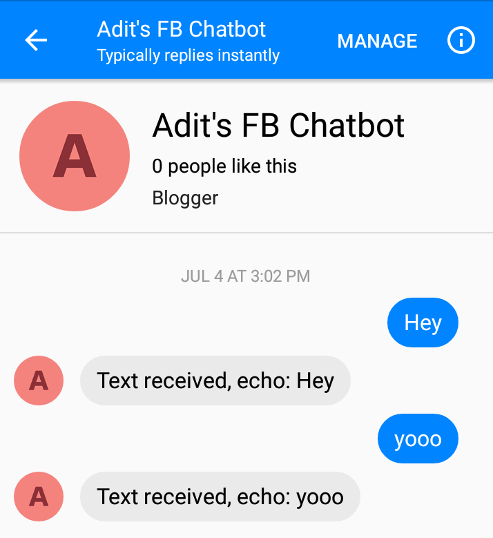
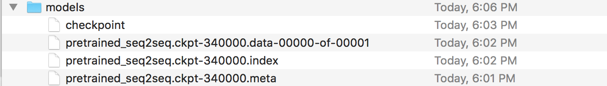
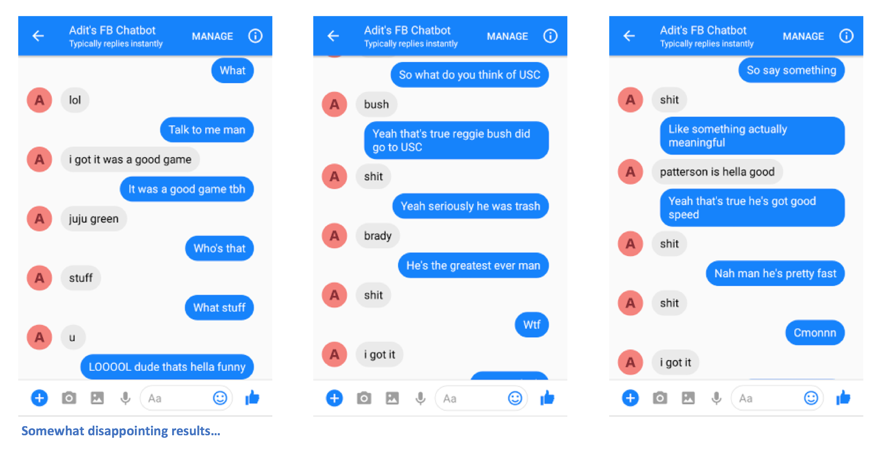

# Facebook-Messenger-Bot

The FB Messenger chatbot that I trained to talk like me. The associated [blog post](https://adeshpande3.github.io/adeshpande3.github.io/How-I-Used-Deep-Learning-to-Train-a-Chatbot-to-Talk-Like-Me). 

## Overview

For this project, I wanted to train a Sequence To Sequence model on my past conversation logs from various social media sites. You can read more about the motivation behind this approach, the details of the ML model, and the purpose of each Python script in the blog post, but I want to use this README to explain how you can train your own chatbot to talk like you. 

## Requirements and Installation
In order to run these scripts, you'll need the following libraries. 

* **[TensorFlow](https://www.tensorflow.org/install/) version 1.0 or later**
* [NumPy](https://docs.scipy.org/doc/numpy/user/install.html)
* [Pandas](https://pandas.pydata.org/pandas-docs/stable/install.html)
* [Sklearn](http://scikit-learn.org/stable/install.html)

## How You Can Train Your Own

1. Download and unzip [this entire repository from GitHub](https://github.com/adeshpande3/Facebook-Messenger-Bot), either interactively, or by entering the following in your Terminal.
    ```bash
    git clone https://github.com/adeshpande3/Facebook-Messenger-Bot.git
    ```

2. Navigate into the top directory of the repo on your machine
    ```bash
    cd Facebook-Messenger-Bot
    ```
3. Our first job is to download all of your conversation data from various social media sites. For me, I used Facebook, Google Hangouts, and LinkedIn. If you have other sites that you're getting data from, that's fine. You just will have to create a new method in [createDataset.py](https://github.com/adeshpande3/Facebook-Messenger-Bot/blob/master/createDataset.py). 

* **Facebook Data**: Download your data from [here](https://www.facebook.com/help/131112897028467). Once downloaded, you should have a fairly large file called **messages.htm**. It'll be a pretty large file (over 190 MB for me). We're going to need to parse through this large file, and extract all of the conversations. To do this, we'll use this [tool](https://github.com/ownaginatious/fbchat-archive-parser) that Dillon Dixon has kindly open sourced. You'll go ahead and install that tool by running
    ```bash
    pip install fbchat-archive-parser
    ```    
    and then running:
    ```bash
    fbcap ./messages.htm > fbMessages.txt
    ```
    This will give you all your Facebook conversations in a fairly unified text file. Thanks Dillon! Go ahead and then store that file in your Facebook-Messenger-Bot folder. 

* **LinkedIn Data**: Download your data from [here](https://www.linkedin.com/psettings/member-data). Once downloaded, you should see an **inbox.csv** file. We won't need to take any other steps here, we just want to copy it over to our folder. 

* **Google Hangouts Data**: Download your data form [here](https://takeout.google.com/settings/takeout/custom/chat). Once downloaded, you'll get a JSON file that we'll need to parse through. To do this, we'll use this [parser](https://takeout.google.com/settings/takeout/custom/chat) found through this phenomenal [blog post](https://blog.jay2k1.com/2014/11/10/how-to-export-and-backup-your-google-hangouts-chat-history/). We'll want to save the data into text files, and then copy the folder over to ours. 

    At the end of all this, you should have a directory structure that looks like this. Make sure you rename the folders and file names if yours are different. 

    
	
* **WhatsApp Data**: Make sure you have a cell phone and put it in the US date-format if it is not already (this will be important later when you parse the log file to .csv). You can not use whatsApp web for this purpose. Open the chat you want to send, tap the menu button, tap more, then click "Email Chat". Send the email to yourself and download it to your computer. This will give you a .txt file, to parse it, we'll convert it to .cvs. To do this go to [this link](http://ocpl.com.bd/whatsapp_parser/) and enter all the text in your log file. Click export, download the csv file and simply store it in your Facebook-Messenger-Bot folder under the name "whatsapp_chats.csv".

4. Now that we have all our conversation logs in a clean format, we can go ahead and create our dataset. In our directory, let's run:
    ```bash
    python createDataset.py
    ```
    You'll then be prompted to enter your name (so that the script knows who to look for), and which social media sites you have data for. This script will create a file named **conversationDictionary.npy** which is a Numpy object that contains pairs in the form of (FRIENDS_MESSAGE, YOUR RESPONSE). A file named **conversationData.txt** will also be created. This is simply a large text file the dictionary data in a unified form. 

5. Now that we have those 2 files, we can start creating our word vectors through a Word2Vec model. This step is a little different from the others. The Tensorflow function we see later on (in seq2seq.py) actually also handles the embedding part. So you can either decide to train your own vectors or have the seq2seq function do it jointly, which is what I ended up doing.**If you want to create your own word vectors though Word2Vec, say y at the prompt (after running the following). If you don't, then that's fine, reply n and this function will only create the wordList.txt.**
    ```bash
    python Word2Vec.py
    ```
    If you run word2vec.py in its entirety, this will create 4 different files. **Word2VecXTrain.npy** and **Word2VecYTrain.npy** are the training matrices that Word2Vec will use. We save these in our folder, in case we need to train our Word2Vec model again with different hyperparameters. We also save **wordList.txt**, which simply contains all of the unique words in our corpus. The last file saved is **embeddingMatrix.npy**  which is a Numpy matrix that contains all of the generatedword vectors. 

6. Now, we can use create and train our Seq2Seq model.
    ```bash
    python Seq2Seq.py
    ```
    This will create 3 or more different files. **Seq2SeqXTrain.npy** and **Seq2SeqYTrain.npy** are the training matrices that Seq2Seq will use. Again, we save these just in case we want to make changes to our model architecture, and we don't want to recompute our training set. The last file(s) will be .ckpt files which holds our saved Seq2Seq model. Models will be saved at different time periods in the training loop. These will be used and deployed once we've created our chatbot. 

7. Now that we have a saved model, let's now create our Facebook chatbot. To do so, I'd recommend following this [tutorial](https://github.com/jw84/messenger-bot-tutorial). You don't need to read anything beneath the "Customize what the bot says" section. Our Seq2Seq model will handle that part. **IMPORTANT - The tutorial will tell you to create a new folder where the Node project will lie.** Keep in mind this folder will be different from our folder. You can think of this folder as being where our data preprocessing and model training lie, while the other folder is strictly reserved for the Express app (EDIT: I believe you can follow the tutorial's steps inside of our folder and just create the Node project, Procfile, and index.js files in here if you want). The tutorial itself should be sufficient, but here's a summary of the steps. 

    - Build the server, and host on Heroku. 
    - Create a Facebook App/Page, set up the webhook, get page token, and trigger the app. 
    - Add an API endpoint to **index.js** so that the bot can respond with messages. 

    After following the steps correctly, you should be able to message the chatbot, and get responses back. 

    

8. Ah, you're almost done! Now, we have to create a Flask server where we can deploy our saved Seq2Seq model. I have the code for that server [here](https://github.com/adeshpande3/Chatbot-Flask-Server). Let's talk about the general structure. Flask servers normally have one main .py file where you define all of the endpoints. This will be [app.py](https://github.com/adeshpande3/Chatbot-Flask-Server/blob/master/app.py) in our case. This whill be where we load in our model. You should create a folder called 'models', and fill it with 4 files (a checkpoint file, a data file, an index file, and a meta file). These are the files that get created when you save a Tensorflow model. 



In this app.py file, we want to create a route (/prediction in my case) where the input to the route will be fed into our saved model, and the decoder output is the string that is returned. Go ahead and take a closer look at app.py if that's still a bit confusing. Now that you have your app.py and your models (and other helper files if you need them), you can deploy your server. We'll be using Heroku again. There are a lot of different tutorials on deploying Flask servers to Heroku, but I like [this one](https://coderwall.com/p/pstm1w/deploying-a-flask-app-at-heroku) in particular (Don't need the Foreman and Logging sections). 

9. Once you have your Flask server deployed, you'll need to edit your index.js file so that the Express app can communicate with your Flask server. Basically, you'll need to send a POST request to the Flask server with the input message that your chatbot receives, receive the output, and then use the sendTextMessage function to have the chatbot respond to the message. If you've cloned my repository, all you really need to do is replace the URL of the request function call with the URL of your own server. 

There ya go. You should be able to send messages to the chatbot, and see some interesting responses that (hopefully) resemble yourelf in some way.

## Samples



**Please let me know if you have any issues or if you have any suggestions for making this README better. If you thought a certain step was unclear, let me know and I'll try my best to edit the README and make any clarifications.**
